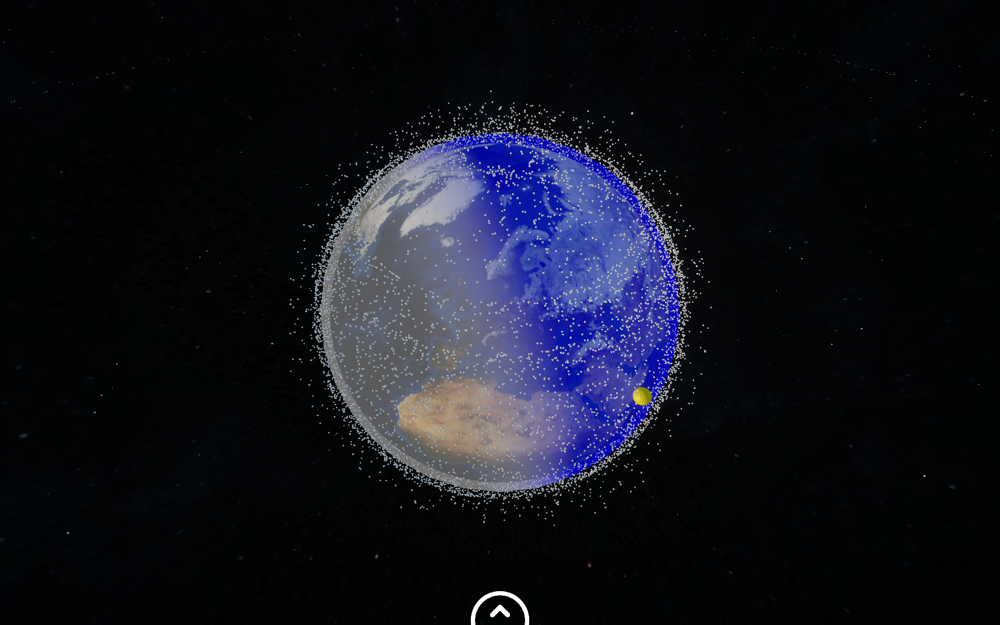

# SatTrak

Interactive 3D satellite visualization built in Unity. TLE orbital elements are pulled from
CelesTrak and propagated with an SGP4 implementation to place the full active catalogue,
around 16000 satellites, on a textured globe. It runs in the browser as a WebGL build served
from a container.



New to the project? [HANDOFF.md](HANDOFF.md) has the current state, what changed and what
is left to do, including the container and release plan.

## Running it

```bash
docker compose pull && docker compose up -d
```

The app is then served on port 8003, or whatever `SATTRAK_PORT` says. The image is
`ghcr.io/janvogt06/sattrak` and is published for `linux/amd64` and `linux/arm64` on every
`v*` tag.

No account and no API key are needed, neither for the container nor for the editor, nor for
anyone opening the page. From orbit the globe is a generated WGS84 ellipsoid with NASA Blue
Marble imagery. Closer in, terrain and Sentinel-2 imagery stream as tiles straight from two
open services, Mapzen Terrain Tiles on AWS and EOX Sentinel-2 cloudless 2016.

## TLE data

Clients never talk to CelesTrak. `SatelliteManager` asks the hosting server for
`tle/active.txt` first and falls back to the snapshot bundled under
`unity/Assets/StreamingAssets/tle/active.txt`. The container fetches that file from CelesTrak
once at start and then every two hours, so one upstream request covers every visitor.
`TLE_REFRESH_SECONDS` changes the interval, `0` turns the refresh off.

Refresh the bundled snapshot with:

```bash
./tools/update-tle-snapshot.sh
```

CelesTrak throttles repeated downloads of the same group and answers with a plain text
notice instead of element sets. The script refuses to write anything that is not in
three line TLE format, and the runtime does the same check before accepting a response.

## Requirements

- Unity 6000.6.0f1
- Git LFS

## Setup

```bash
git lfs install
git clone https://github.com/JanVogt06/SatTrak-SatelliteVisualization.git
cd SatTrak-SatelliteVisualization
git lfs pull
```

Without `git lfs pull` the satellite models and the city database stay 130-byte pointer
files and the project will not run.

Add `unity/` as a project in Unity Hub and open it.

## Controls

Space mode:

| Input | Action |
| --- | --- |
| Left mouse drag | Rotate the globe |
| Scroll wheel over the time slider | Change the slider step |
| `Esc` | Close the help panel |

Earth mode:

| Input | Action |
| --- | --- |
| `Esc` | Toggle inspection and camera mode |
| `W` `A` `S` `D` or arrow keys | Move, faster the higher you are |
| `Space` / `C` | Move up / down |
| Mouse | Look around |
| `Shift` | Move ten times faster |
| `R` | Return to the start position |

## Repository layout

```
HANDOFF.md                    State of the project and open work
Dockerfile, docker/           nginx image and its TLE refresh entrypoint
art-source/                   Full quality originals of shrunk models and music (Git LFS)
screenshots/                  README image
tools/                        Maintenance scripts
unity/
  Assets/
    AddressableAssetsData/    Addressables configuration (fixed path)
    TextMesh Pro/             TextMesh Pro essentials (fixed path)
    Project/                  Everything written for this project
      Art/                    Animations, fonts, images, materials, UI sprites
      Art/Earth/              Blue Marble texture and globe material (Git LFS)
      Data/Cities/            GeoNames city database (Git LFS)
      Localization/           German and English string tables
      Models/                 Satellite models (Git LFS)
      Prefabs/
      Resources/HelpImages/   Loaded at runtime by the help panel
      Scenes/                 MainMenu and GameScene
      Scripts/
      Settings/               URP render pipeline assets
    WebGLTemplates/SatTrak/   The web page around the player: loader, toolbar, credits
    StreamingAssets/          Served as loose files next to the build
      models/                 ISS model, loaded on demand (Git LFS)
      music/                  Background music, streamed (Git LFS)
      tle/                    Bundled TLE snapshot
    ThirdParty/               Vendored assets, kept as delivered
      DoubleSlider/           Altitude range slider
      SGP/                    SGP4 propagator port
      SimpleSpinner/          Loading spinner
      Skyboxes/               Space skyboxes
  Packages/                   Unity Package Manager manifest and lock file
  ProjectSettings/
```

## Scripts

| Script | Responsibility |
| --- | --- |
| `Satellites/SatelliteManager` | TLE download, satellite spawning, job scheduling |
| `Satellites/Satellite` | Per-satellite state and orbital elements |
| `Satellites/SatelliteOrbit` | Orbit path rendering |
| `Satellites/SatelliteModelController` | Model and sphere switching per camera mode |
| `Satellites/MoveSatelliteJobParallelForTransform` | Job moving satellite transforms |
| `Satellites/ConversionExtensions` | ECI to earth fixed coordinate conversion |
| `Satellites/TleSource` | Loads TLE data from the server, falls back to the bundled snapshot |
| `Geo/Wgs84` | Ellipsoid math: geodetic and ECEF conversion, East-Up-North frame |
| `Geo/Georeference` | Local frame origin, ECEF transforms, floating origin |
| `Geo/GlobeAnchor` | Keeps a transform fixed to a geographic position |
| `Geo/EarthGlobe` | Generates the textured globe mesh |
| `Geo/TerrainTiles` | Picks, loads and caches terrain tiles near the camera |
| `Geo/TerrainTile`, `Geo/TerrainTileKey` | One tile's mesh and its Web Mercator address |
| `ViewModeController` | Transition between space and earth mode |
| `FreeFlyCamera` | First person camera for earth mode |
| `GlobeRotationController` | Orbit camera around the globe |
| `CameraFlySequence` | Scripted camera moves in the main menu |
| `Lighting/DayNightSystem` | Sun position and ambient light |
| `Lighting/EarthDayNightOverlay` | Terminator overlay shader driver |
| `Heatmap/HeatmapController` | Satellite density heatmap |
| `Heatmap/HeatmapDensityJob` | Burst job computing density |
| `TimeSlider/TimeSlider` | Simulated time and time multiplier |
| `TimeSlider/SliderStep` | Slider zoom steps |
| `UI/SearchPanelController` | Satellite search, filter and tracking |
| `UI/GameHudController` | HUD animations, FPS display, quit |
| `UI/HelpContentBuilder` | Renders the markdown help pages |
| `UI/HelpPanelController` | Help panel visibility |
| `UI/TabBarController` | Tab switching |
| `UI/SatelliteLabelUI` | Satellite name labels |
| `UI/SatelliteShowHide` | Satellite visibility toggle |
| `UI/ISSQuickButton` | Jump to the ISS |
| `UI/TooltipController` | Tooltips |
| `UI/TOCButton` | Help table of contents entries |
| `UI/HelpImageScaler` | Aspect ratio for help images |
| `UI/ForceAspectRatio16x9` | Letterboxing |
| `GeoNamesSearchFromJSON` | City search over the GeoNames database |
| `MenuManager` | Main menu, resolution and language settings |
| `SceneSwitcher` | Async scene loading with progress bar |
| `MusicManager` | Background music playback |
| `CrosshairSelector`, `CrosshairSettings`, `CustomCursor` | Crosshair and cursor customization |
| `MainMenuCameraMovement`, `MainMenuSatelliteSpawner`, `FlyingUIPhysics` | Main menu decoration |

## Data sources

- TLE data: [CelesTrak](https://celestrak.org/)
- City database: [GeoNames](https://www.geonames.org/)
- Satellite models: NASA
- Earth texture: NASA Visible Earth, Blue Marble Next Generation (public domain)
- Terrain: [Mapzen Terrain Tiles](https://registry.opendata.aws/terrain-tiles/) on AWS Open
  Data, with the upstream sources listed in the page's info dialog
- Imagery: [Sentinel-2 cloudless](https://s2maps.eu) by EOX IT Services GmbH (contains modified
  Copernicus Sentinel data 2016), CC BY 4.0
- Typeface: League Spartan, SIL Open Font License

## Credits

University project at FSU Jena by Jan Vogt, Yannik Köllmann, Leon Erdhütter and
Niklas Maximilian Becker-Klöster.
